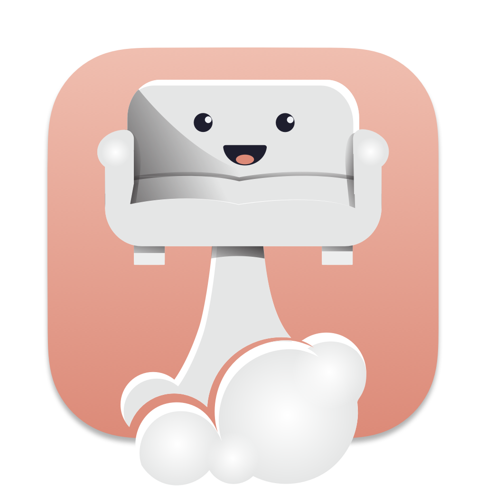

<h1 align="center">
	<br/>
	Loungy
</h1>

<p align="center">
Loungy is an application launcher in the vein of Raycast and Alfred.<br>
It's built using GPUI, a GPU accelerated application framework for Rust.
</p>

## Showcase

https://github.com/MatthiasGrandl/Loungy/assets/50196894/d5c84579-77e6-4e0b-980a-7d1f1975d713

## Why

Mostly as a learning/hobby project. It isn't (yet) intended to be used outside of experimentation.
I got the idea while writing a Raycast plugin and getting frustrated with their limitations.

## How

Initially I wrote it using Tauri as I am familiar with web technologies, but quickly got fed up with moving info from rust side to the webview. Around the same time the awesome folks from [Zed](https://zed.dev/) open sourced [GPUI](https://www.gpui.rs/), which is a Rust based GPU accelerated application framework. It instantly intrigued me due to its Tailwind CSS inspiration.

### Credits

Loungy wouldn't be possible without the awesome open source ecosystem:

- [GPUI](https://www.gpui.rs/) : The lovely framework
- [Numbat](https://numbat.dev/) : Used as the calculator
- [Lucide](https://lucide.dev/) : Amazing open source SVG icon-set
- [Catppuccin](https://github.com/catppuccin) : The theme that makes everything look good
- [swift-rs](https://github.com/Brendonovich/swift-rs) : For providing a way to interface with accessibility APIs and other MacOS native stuff that I wouldn't know how to do with pure Rust
- [nucleo](https://github.com/helix-editor/nucleo) : Fuzzy searcher implemented by the team of my favorite modal editor [Helix](https://github.com/helix-editor/helix)

## Features

- [x] Launching apps
- [x] Calculator (including unit/currency/date conversions, thanks to [Numbat](https://numbat.dev/))
- [x] Task manager (killing processes)
- [x] MacOS menu search
- [x] Clipboard manager
- [x] Tailscale peer list
- [x] Bitwarden password client (only viewing, not editing)
- [x] Matrix Chat client (very early WIP)

In the absence of a proper extension system (which is wanted, but still quite far out at this point) I am adding features I need, but that aren't universally useful behind cargo feature flags.

So far there is `clipboard`, `tailscale`, `bitwarden` and `matrix`. You can also build all optional features with `cargo build --all-features --release`.

## Development

### Requirements

- Xcode Apple Swift 5.9.2
- Rust v1.75.0

### Running

```
cargo run dev
```

## Caveats

- ~~It is MacOS only, but I would love to support a Linux build in the future. That won't happen until GPUI adds Linux support.~~ There is some very rough Linux support. It's still very early since a lot of functionality in GPUI required for Loungy hasn't made it into the Linux GPUI yet (they are obviously focusing on getting Zed features running first).
- Accessibility is still a nightmare. GPUI is lacking a proper accessible text input so currently I am implementing one myself. Screen readers or people with impairments please don't try to use this yet.
- ~~The window position is currently hardcoded, so depending on your screen resolution it might not be in the best position. Will be fixed as soon as there is an API for it in GPUI.~~ I kinda fixed this, but it's probably still wonky on multi display setups.
- ~~The hotkey is currently hardcoded to `Opt+Ctrl+Cmd+Space`~~ Hotkeys are now rebindable, but it's still a bit sketchy since GPUI doesn't report raw keycodes, while the Tauri hotkey manager uses raw keycodes. To rebind you can simple select any command in the root search and use the `Change Hotkey` action.

### Linux

Experimental Linux support. Building requires (on Fedora Wayland):

- `openssl-devel`
- `wayland-devel`
- `g++`
- `fontconfig-devel`
- `libxcb-devel`
- `libxkbcommon-x11-devel`
- `libxkbcommon-devel`

Many features won't work yet, since I am using a lot of MacOS specific APIs for autofilling. So notably the `clipboard` and `bitwarden` features will need Linux specific implementations to get working.
