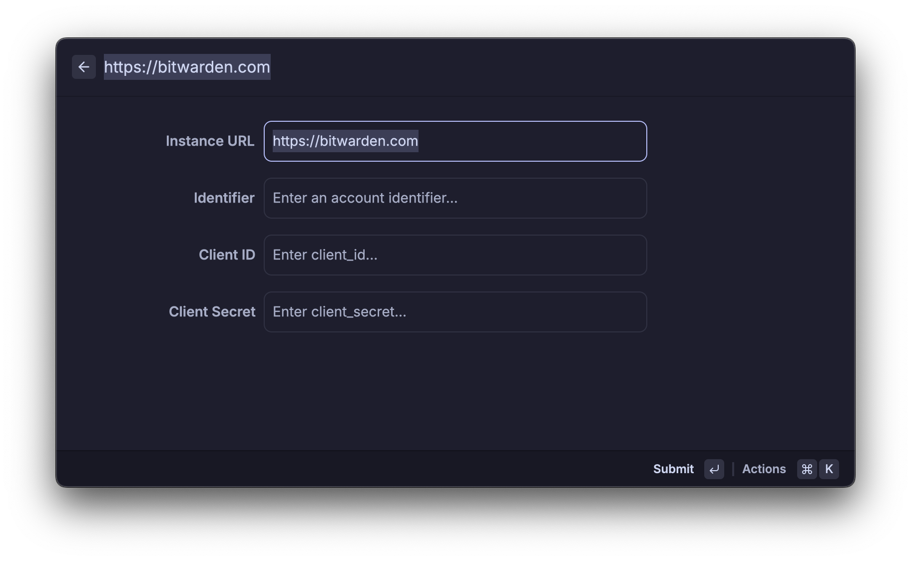

# Bitwarden

Bitwarden is a lovely password manager so I had to integrate it into Loungy.

## Features

- [x] Support for multiple accounts/vaults
- [x] TOTP
- [x] Autofilling/Typing using MacOS accessibility API
- [x] Self-hosted instances

## Requirements

It uses the official Bitwarden CLI so make sure you have that installed.

`brew install bitwarden-cli`

## Setup

When you first open the Bitwarden command it will ask you to add an account:

- **Instance URL**: If you use the official Bitwarden website, leave this as is. If you are using a custom server, enter that here
- **Identifier**: This is an ID you can use to differentiate accounts if you have multiple. Can be anything
- **Client ID** & **Client Secret**: Because I don't want to deal with all kinds of authentication methods, we just use API keys for authentication. To get those go to the web vault and go to `Account Settings` -> `Security` -> `View API Key`

Once you submit this form, it will prompt you for your master password to unlock the vault. You can decide whether you want Loungy to remember your password, so it can unlock your vault whenever the session expires. Otherwise you will be prompted as soon as that happens.

Both the API keys and the password are persisted in the encrypted key value store Loungy uses.

**Disclaimer**: I don't make any security guarantees and won't take any responsibility for the safety of your passwords!
