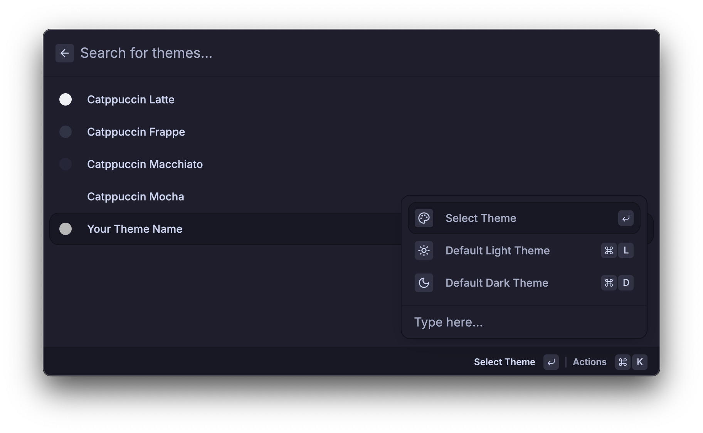

# Themes

The default themes provided are the [Catppuccin](https://github.com/catppuccin/catppuccin) flavors.

## User themes

There is now also support for custom user themes.

For this, simply create a folder `.config/loungy/themes`.

There create a `.toml` file with the following structure:

```rust
name = "Tokyonight Night"
# Valid types are "transparent" and "blurred". If you want a solid color, just don't include this field.
window_background = { type = "blurred", opacity = 0.9 }
font_sans = "Inter"
font_mono = "JetBrains Mono"
flamingo = "#ff9e64"
pink = "#f7768e"
mauve = "#bb9af7"
red = "#db4b4b"
maroon = "#414868"
peach = "#e0af68"
yellow = "#e0af68"
green = "#9ece6a"
teal = "#7dcfff"
sky = "#7aa2f7"
sapphire = "#7aa2f7"
blue = "#7aa2f7"
lavender = "#c0caf5"
text = "#c0caf5"
subtext1 = "#9B9EBB"
subtext0 = "#D8D9E4"
overlay2 = "#BCBED1"
overlay1 = "#A1A4BF"
overlay0 = "#898CAE"
surface2 = "#6E719C"
surface1 = "#595C82"
surface0 = "#464967"
base = "#36384F"
mantle = "#232533"
crust = "#1A1B26"

```

The colors support both `#RRGGBB` and `#RRGGBBAA` format.

When you restart Loungy you can then go to the `Search Themes` command and make your custom theme the new default!



**Important**: I don't guarantee that this format will remain supported as it's still quite early in the development.
